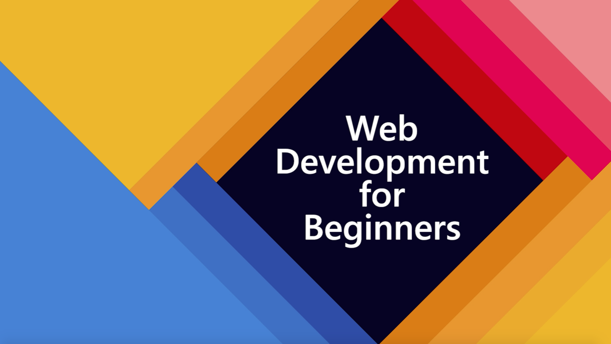

# নতুনদের জন্য ওয়েব ডেভেলপমেন্ট - একটি পাঠ্যক্রম

মাইক্রোসফটের অ্যাজুর ক্লাউড অ্যাডভোকেটরা জাভাস্ক্রিপ্ট, সিএসএস এবং এইচটিএমএল বুনিয়াদি সম্পর্কে 12-সপ্তাহের, 24-পাঠের পাঠ্যক্রম সরবরাহ করতে পেরে খুশি। প্রতিটি পাঠে প্রাক-এবং পাঠ-পরবর্তী কুইজ, পাঠ সম্পূর্ণ করার জন্য লিখিত নির্দেশাবলী, একটি সমাধান, একটি নিয়োগ এবং আরও অনেক কিছু অন্তর্ভুক্ত রয়েছে। আমাদের প্রকল্প-ভিত্তিক শিক্ষাবিজ্ঞান আপনাকে নির্মাণের সময় শিখতে দেয়, নতুন দক্ষতার জন্য 'স্টিক' করার একটি প্রমাণিত উপায়।

**আমাদের লেখক জেন লুপার, ক্রিস নরিং, ক্রিস্টোফার হ্যারিসন, জেসমিন গ্রিনওয়ে, ইয়োহান লাসোরসা, ফ্লোর ড্রিজ এবং স্কেচনোট শিল্পী টোমোমি ইমুরাকে আন্তরিক ধন্যবাদ!**

# শুরু হচ্ছে

> **শিক্ষক**, আমরা এই পাঠ্যক্রমটি কীভাবে ব্যবহার করব সে বিষয়ে [কিছু পরামর্শ](for-teachers.bn.md) অন্তর্ভুক্ত করেছি। আমরা আপনার মতামত চাই [আমাদের আলোচনা ফোরামে](https://github.com/microsoft/Web-Dev-For-Beginners/discussions/categories/teacher-corner)!

> **শিক্ষার্থীরা**, এই পাঠ্যক্রমটি নিজেরাই ব্যবহার করতে, সম্পূর্ণ রেপো ফর্ক করুন এবং প্রাক-বক্তৃতা ক্যুইজ দিয়ে শুরু করে অনুশীলনগুলি সম্পূর্ণ করুন, তারপরে বক্তৃতাটি পড়ুন এবং বাকি কার্যক্রমগুলি সম্পন্ন করুন। সমাধান কোডটি অনুলিপি করার চেয়ে পাঠগুলি বোঝার মাধ্যমে প্রকল্পগুলি তৈরি করার চেষ্টা করুন; তবে সেই কোডটি প্রতিটি প্রকল্প-ভিত্তিক পাঠের /সমাধান ফোল্ডারে পাওয়া যায়। আরেকটি ধারণা হবে বন্ধুদের নিয়ে একটি স্টাডি গ্রুপ গঠন করা এবং একসঙ্গে বিষয়বস্তু দিয়ে যাওয়া। আরও অধ্যয়নের জন্য, আমরা [মাইক্রোসফট লার্ন] সুপারিশ করি

> The প্রকল্পের উপর একটি ভিডিও এবং যারা এটি তৈরি করেছেন তাদের জন্য উপরের ছবিতে ক্লিক করুন!

## শিক্ষাবিজ্ঞান

এই পাঠ্যক্রমটি তৈরির সময় আমরা দুটি শিক্ষাগত নীতি বেছে নিয়েছি: এটি নিশ্চিত করে যে এটি প্রকল্প ভিত্তিক এবং এতে ঘন ঘন কুইজ অন্তর্ভুক্ত রয়েছে। এই সিরিজের শেষের দিকে, শিক্ষার্থীরা একটি টাইপিং গেম, একটি ভার্চুয়াল টেরারিয়াম, একটি 'সবুজ' ব্রাউজার এক্সটেনশন, একটি 'স্পেস ইনভেডার্স' টাইপ গেম এবং একটি বিজনেস-টাইপ ব্যাংকিং অ্যাপ তৈরি করবে এবং জাভাস্ক্রিপ্টের মূল বিষয়গুলি শিখে ফেলবে , HTML, এবং CSS এর সাথে আজকের ওয়েব ডেভেলপারের আধুনিক টুলচেইন।

> 🎓 এই পাঠ্যক্রমের প্রথম কয়েকটি পাঠ আপনি [শিখুন পথ](https://docs.microsoft.com/learn/paths/web-development-101?WT.mc_id=academic-13441-cxa) হিসাবে নিতে পারেন মাইক্রোসফট শিখুন!

বিষয়বস্তু প্রকল্পগুলির সাথে সামঞ্জস্যপূর্ণ তা নিশ্চিত করার মাধ্যমে, প্রক্রিয়াটি শিক্ষার্থীদের জন্য আরও আকর্ষণীয় করে তোলা হয়েছে এবং ধারণার ধারণকে বাড়ানো হবে। "[বিগিনারস-সিরিজ-টু:-জাভাস্ক্রিপ্ট](https://channel9.msdn.com/Series/Beginners-Series-to-JavaScript?WT.mc_id=academic-13441-cxa)" ভিডিও টিউটোরিয়ালের সংগ্রহ, যাদের কিছু লেখক এই পাঠ্যক্রমটিতে অবদান রেখেছিলেন।

উপরন্তু, একটি ক্লাসের আগে একটি লো-স্টেক কুইজ একটি বিষয় শেখার দিকে শিক্ষার্থীর অভিপ্রায় নির্ধারণ করে, যখন ক্লাসের পর একটি দ্বিতীয় কুইজ আরও ধরে রাখা নিশ্চিত করে। এই পাঠ্যক্রমটি নমনীয় এবং মজাদার হওয়ার জন্য ডিজাইন করা হয়েছিল এবং এটি পুরো বা আংশিকভাবে নেওয়া যেতে পারে। প্রকল্পগুলি ছোট শুরু হয় এবং 12 সপ্তাহ চক্রের শেষে ক্রমবর্ধমান জটিল হয়ে ওঠে।

যদিও আমরা ইচ্ছাকৃতভাবে জাভাস্ক্রিপ্ট কাঠামো প্রবর্তন এড়িয়ে গেছি যাতে একটি ওয়েব ডেভেলপার হিসেবে প্রয়োজনীয় মৌলিক দক্ষতার উপর মনোযোগ কেন্দ্রীভূত করার আগে, এই পাঠ্যক্রমটি সম্পন্ন করার জন্য একটি ভাল পরবর্তী ধাপ হল ভিডিওগুলির আরেকটি সংগ্রহের মাধ্যমে Node.js সম্পর্কে শেখা: "[প্রারম্ভিক সিরিজ: Node.js](https://channel9.msdn.com/Series/Beginners-Series-to-Nodejs?WT.mc_id=academic-13441-cxa)"।

> আমাদের [আচরণবিধি](CODE_OF_CONDUCT.md), [অবদান](CONTRIBUTING.md), এবং [অনুবাদ](TRANSLATIONS.md) নির্দেশিকা খুঁজুন। আমরা আপনার গঠনমূলক মতামতকে স্বাগত জানাই!
>
## প্রতিটি পাঠের মধ্যে রয়েছে:

- চ্ছিক স্কেচনোট
- alচ্ছিক সম্পূরক ভিডিও
- প্রাক-পাঠ ওয়ার্মআপ কুইজ
- লিখিত পাঠ
- প্রকল্প-ভিত্তিক পাঠের জন্য, কিভাবে প্রকল্পটি তৈরি করতে হবে তার ধাপে ধাপে নির্দেশিকা
- জ্ঞান চেক
- একটি চ্যালেঞ্জ
- পরিপূরক পড়া
- নিয়োগ
- পাঠ-পরবর্তী কুইজ

> **কুইজ সম্বন্ধে একটি নোট**: সমস্ত কুইজ [এই অ্যাপে](https://nice-beach-0fe9e9d0f.azurestaticapps.net/) রয়েছে, প্রতিটি তিনটি প্রশ্নের মোট 48 টি কুইজের জন্য। তারা পাঠের মধ্যে থেকে সংযুক্ত কিন্তু কুইজ অ্যাপ্লিকেশন স্থানীয়ভাবে চালানো যেতে পারে; `কুইজ-অ্যাপ` ফোল্ডারে নির্দেশ অনুসরণ করুন। তারা ধীরে ধীরে স্থানীয়করণ করা হচ্ছে।

## পাঠ

|       |                       Project Name                       |                            Concepts Taught                             | Learning Objectives                                                                                                                 |                                                         Linked Lesson                                                          |         Author          |
| :---: | :------------------------------------------------------: | :--------------------------------------------------------------------: | ----------------------------------------------------------------------------------------------------------------------------------- | :----------------------------------------------------------------------------------------------------------------------------: | :---------------------: |
|  01   |                     Getting Started                      |           Introduction to Programming and Tools of the Trade           | Learn the basic underpinnings behind most programming languages and about software that helps professional developers do their jobs | [Intro to Programming Languages and Tools of the Trade](/1-getting-started-lessons/1-intro-to-programming-languages/README.md) |         Jasmine         |
|  02   |                     Getting Started                      |             Basics of GitHub, includes working with a team             | How to use GitHub in your project, how to collaborate with others on a code base                                                    |                            [Intro to GitHub](/1-getting-started-lessons/2-github-basics/README.md)                             |          Floor          |
|  03   |                     Getting Started                      |                             Accessibility                              | Learn the basics of web accessibility                                                                                               |                       [Accessibility Fundamentals](/1-getting-started-lessons/3-accessibility/README.md)                       |       Christopher       |
|  04   |                        JS Basics                         |                         JavaScript Data Types                          | The basics of JavaScript data types                                                                                                 |                                       [Data Types](/2-js-basics/1-data-types/README.md)                                        |         Jasmine         |
|  05   |                        JS Basics                         |                         Functions and Methods                          | Learn about functions and methods to manage an application's logic flow                                                             |                              [Functions and Methods](/2-js-basics/2-functions-methods/README.md)                               | Jasmine and Christopher |
|  06   |                        JS Basics                         |                        Making Decisions with JS                        | Learn how to create conditions in your code using decision-making methods                                                           |                                 [Making Decisions](/2-js-basics/3-making-decisions/README.md)                                  |         Jasmine         |
|  07   |                        JS Basics                         |                            Arrays and Loops                            | Work with data using arrays and loops in JavaScript                                                                                 |                                   [Arrays and Loops](/2-js-basics/4-arrays-loops/README.md)                                    |         Jasmine         |
|  08   |       [Terrarium](/3-terrarium/solution/README.md)       |                            HTML in Practice                            | Build the HTML to create an online terrarium, focusing on building a layout                                                         |                                 [Introduction to HTML](/3-terrarium/1-intro-to-html/README.md)                                 |           Jen           |
|  09   |       [Terrarium](/3-terrarium/solution/README.md)       |                            CSS in Practice                             | Build the CSS to style the online terrarium, focusing on the basics of CSS including making the page responsive                     |                                  [Introduction to CSS](/3-terrarium/2-intro-to-css/README.md)                                  |           Jen           |
|  10   |            [Terrarium](/3-terrarium/solution)            |                 JavaScript Closures, DOM manipulation                  | Build the JavaScript to make the terrarium function as a drag/drop interface, focusing on closures and DOM manipulation             |                  [JavaScript Closures, DOM manipulation](/3-terrarium/3-intro-to-DOM-and-closures/README.md)                   |           Jen           |
|  11   |          [Typing Game](/4-typing-game/solution)          |                          Build a Typing Game                           | Learn how to use keyboard events to drive the logic of your JavaScript app                                                          |                                [Event-Driven Programming](/4-typing-game/typing-game/README.md)                                |       Christopher       |
|  12   | [Green Browser Extension](/5-browser-extension/solution) |                         Working with Browsers                          | Learn how browsers work, their history, and how to scaffold the first elements of a browser extension                               |                               [About Browsers](/5-browser-extension/1-about-browsers/README.md)                                |           Jen           |
|  13   | [Green Browser Extension](/5-browser-extension/solution) | Building a form, calling an API and storing variables in local storage | Build the JavaScript elements of your browser extension to call an API using variables stored in local storage                      |                [APIs, Forms, and Local Storage](/5-browser-extension/2-forms-browsers-local-storage/README.md)                 |           Jen           |
|  14   | [Green Browser Extension](/5-browser-extension/solution) |          Background processes in the browser, web performance          | Use the browser's background processes to manage the extension's icon; learn about web performance and some optimizations to make   |             [Background Tasks and Performance](/5-browser-extension/3-background-tasks-and-performance/README.md)              |           Jen           |
|  15   |           [Space Game](/6-space-game/solution)           |             More Advanced Game Development with JavaScript             | Learn about Inheritance using both Classes and Composition and the Pub/Sub pattern, in preparation for building a game              |                      [Introduction to Advanced Game Development](/6-space-game/1-introduction/README.md)                       |          Chris          |
|  16   |           [Space Game](/6-space-game/solution)           |                           Drawing to canvas                            | Learn about the Canvas API, used to draw elements to a screen                                                                       |                                [Drawing to Canvas](/6-space-game/2-drawing-to-canvas/README.md)                                |          Chris          |
|  17   |           [Space Game](/6-space-game/solution)           |                   Moving elements around the screen                    | Discover how elements can gain motion using the cartesian coordinates and the Canvas API                                            |                           [Moving Elements Around](/6-space-game/3-moving-elements-around/README.md)                           |          Chris          |
|  18   |           [Space Game](/6-space-game/solution)           |                          Collision detection                           | Make elements collide and react to each other using keypresses and provide a cooldown function to ensure performance of the game    |                              [Collision Detection](/6-space-game/4-collision-detection/README.md)                              |          Chris          |
|  19   |           [Space Game](/6-space-game/solution)           |                             Keeping score                              | Perform math calculations based on the game's status and performance                                                                |                                    [Keeping Score](/6-space-game/5-keeping-score/README.md)                                    |          Chris          |
|  20   |           [Space Game](/6-space-game/solution)           |                     Ending and restarting the game                     | Learn about ending and restarting the game, including cleaning up assets and resetting variable values                              |                                [The Ending Condition](/6-space-game/6-end-condition/README.md)                                 |          Chris          |
|  21   |         [Banking App](/7-bank-project/solution)          |                 HTML Templates and Routes in a Web App                 | Learn how to create the scaffold of a multipage website's architecture using routing and HTML templates                             |                            [HTML Templates and Routes](/7-bank-project/1-template-route/README.md)                             |          Yohan          |
|  22   |         [Banking App](/7-bank-project/solution)          |                  Build a Login and Registration Form                   | Learn about building forms and handing validation routines                                                                          |                                           [Forms](/7-bank-project/2-forms/README.md)                                           |          Yohan          |
|  23   |         [Banking App](/7-bank-project/solution)          |                   Methods of Fetching and Using Data                   | How data flows in and out of your app, how to fetch it, store it, and dispose of it                                                 |                                            [Data](/7-bank-project/3-data/README.md)                                            |          Yohan          |
|  24   |         [Banking App](/7-bank-project/solution)          |                      Concepts of State Management                      | Learn how your app retains state and how to manage it programmatically                                                              |                                [State Management](/7-bank-project/4-state-management/README.md)                                |          Yohan          |

## অফলাইন অ্যাক্সেস

আপনি [ডকসিফাই](https://docsify.js.org/#/) ব্যবহার করে এই ডকুমেন্টেশন অফলাইনে চালাতে পারেন। এই রেপোটি ফর্ক করুন, আপনার স্থানীয় মেশিনে [ডকসিফাই ইনস্টল করুন](https://docsify.js.org/#/quickstart), এবং তারপর এই রেপোর রুট ফোল্ডারে, 'ডকসিফাই সার্ভ' টাইপ করুন। ওয়েবসাইটটি আপনার লোকাল হোস্টে পোর্ট 3000 এ পরিবেশন করা হবে: `localhost: 3000`।

## পিডিএফ

সমস্ত পাঠের একটি পিডিএফ পাওয়া যাবে [এখানে](পিডিএফ/রিডমে.পিডিএফ)

## অন্যান্য পাঠ্যক্রম

আমাদের দল অন্যান্য পাঠ্যক্রম তৈরি করে! চেক আউট:

- [নতুনদের জন্য মেশিন লার্নিং](https://aka.ms/ml-beginners)
- [নতুনদের জন্য IoT](https://aka.ms/iot-beginners)