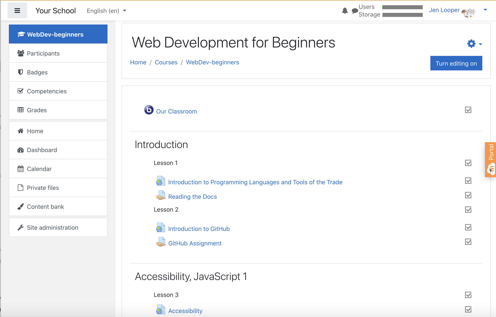
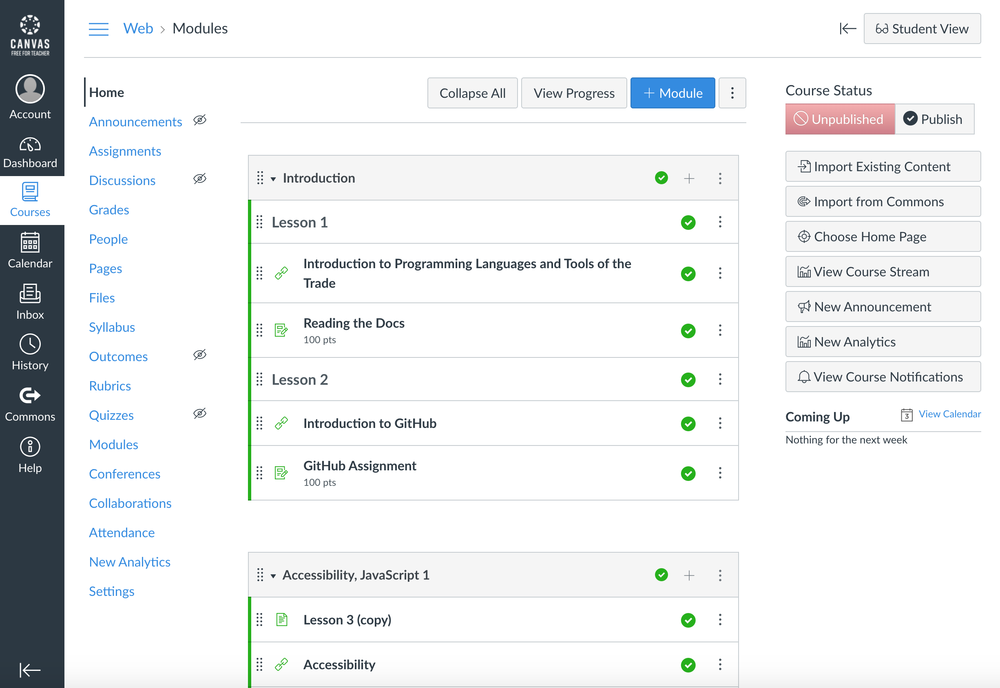

## শিক্ষাবিদদের জন্য

আপনি কি এই পাঠ্যক্রমটি আপনার শ্রেণীকক্ষে ব্যবহার করতে চান? অনুগ্রহ করে মুক্ত মনে করুন!

আসলে, আপনি GitHub ক্লাসরুম ব্যবহার করে GitHub এর মধ্যেই এটি ব্যবহার করতে পারেন।

এটি করার জন্য, এই রেপো Fork করুন। আপনাকে প্রতিটি পাঠের জন্য একটি রেপো তৈরি করতে হবে, তাই আপনাকে প্রতিটি ফোল্ডার আলাদা রেপোতে বের করতে হবে। এই ভাবে, [GitHub Classroom](https://classroom.github.com/classrooms) প্রতিটি পাঠ আলাদাভাবে নিতে পারে।

এই [সম্পূর্ণ নির্দেশাবলী](https://github.blog/2020-03-18-set-up-your-digital-classroom-with-github-classroom/) আপনাকে আপনার ক্লাসরুম সেট আপ করার একটি ধারণা দেবে।

## এটি মুডল, ক্যানভাস বা ব্ল্যাকবোর্ডে ব্যবহার করা

এই পাঠ্যক্রম এই লার্নিং ম্যানেজমেন্ট সিস্টেমে ভাল কাজ করে! সম্পূর্ণ বিষয়বস্তুর জন্য [মুডেল আপলোড ফাইল](../teaching-files/webdev-moodle.mbz) ব্যবহার করুন অথবা [সাধারণ কার্তুজ ফাইল](../teaching-files/webdev-common-cartridge.imscc) ব্যবহার করুন যাতে কিছু সূচিপত্র. মুডল ক্লাউড সম্পূর্ণ সাধারণ কার্তুজ রপ্তানি সমর্থন করে না, তাই মুডল ডাউনলোড ফাইলটি ব্যবহার করা ভাল যা ক্যানভাসে আপলোড করা যায়। দয়া করে আমাদের জানান কিভাবে আমরা এই অভিজ্ঞতার উন্নতি করতে পারি।

> মুডল শ্রেণিকক্ষে পাঠ্যক্রম

> ক্যানভাসে পাঠ্যক্রম

## রেপো ব্যবহার করা হচ্ছে

আপনি যদি গিটহাব ক্লাসরুম ব্যবহার না করে এই রেপোটি বর্তমানে যেমন ব্যবহার করতে চান, এটিও করা যেতে পারে। আপনার ছাত্রদের সাথে কোন পাঠের মাধ্যমে একসাথে কাজ করতে হবে তার সাথে যোগাযোগ করতে হবে।

একটি অনলাইন ফর্ম্যাটে (জুম, টিমস বা অন্যান্য) আপনি কুইজের জন্য ব্রেকআউট রুম তৈরি করতে পারেন এবং শিক্ষার্থীদের শেখার জন্য প্রস্তুত হতে সাহায্য করার জন্য পরামর্শদাতা। তারপরে শিক্ষার্থীদের কুইজের জন্য আমন্ত্রণ জানান এবং একটি নির্দিষ্ট সময়ে তাদের উত্তরগুলি 'সমস্যা' হিসাবে জমা দিন। আপনি যদি অ্যাসাইনমেন্টের ক্ষেত্রেও একই কাজ করতে পারেন, যদি আপনি চান ছাত্ররা খোলাখুলিভাবে সহযোগিতামূলকভাবে কাজ করে।

আপনি যদি আরও বেশি ব্যক্তিগত বিন্যাস পছন্দ করেন, তাহলে আপনার শিক্ষার্থীদের পাঠ্যক্রম পাঠ, পাঠ অনুসারে, তাদের নিজস্ব গিটহাব রেপোকে প্রাইভেট রেপোস হিসাবে বলুন এবং আপনাকে অ্যাক্সেস দিতে দিন। তারপর তারা ব্যক্তিগতভাবে কুইজ এবং অ্যাসাইনমেন্ট সম্পন্ন করতে পারে এবং আপনার ক্লাসরুমের রেপোর সমস্যাগুলির মাধ্যমে সেগুলি আপনার কাছে জমা দিতে পারে।

একটি অনলাইন শ্রেণীকক্ষ বিন্যাসে এই কাজটি করার অনেক উপায় আছে। অনুগ্রহ করে আমাদের জানান কি আপনার জন্য সবচেয়ে ভাল কাজ করে!

## দয়া করে আমাদের আপনার মতামত দিন!

আমরা এই পাঠ্যক্রমটি আপনার এবং আপনার শিক্ষার্থীদের জন্য কার্যকর করতে চাই। অনুগ্রহ করে আমাদের [মতামত](https://forms.microsoft.com/Pages/ResponsePage.aspx?id=v4j5cvGGr0GRqy180BHbR2humCsRZhxNuI79cm6n0hRUQzRVVU9VVlU5UlFLWTRLWlkyQUxORTg5WS4u) দিন 